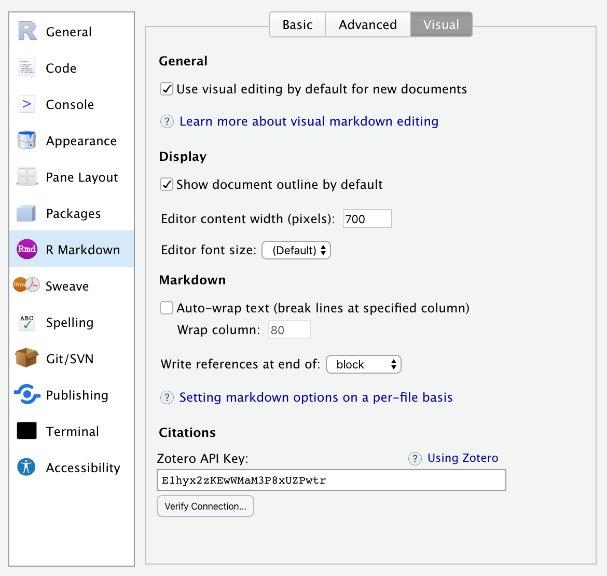

<!-- -*- mode: gfm -*- -->

## CSS Styles

One of the benefits of authoring with markdown is that your content can be easily published to a wide variety of formats. This is possible in significant measure because of the limitations that markdown imposes: you author in terms of the structure and semantics of your content, rather than worrying about specifically how things will appear.

Sometimes however you know that you'll be publishing to HTML, and you want to exert more control over how things look. In this case, you can use [CSS](https://developer.mozilla.org/en-US/docs/Web/CSS) (Cascading Style Sheets) along with markdown to do custom formatting. This section covers how to:

1.  Define CSS styles for your document; and

2.  Apply those styles to entities within your document.

If you are new to CSS, you may want to [brush up on the basics](https://developer.mozilla.org/en-US/docs/Learn/CSS) before proceeding.

?\> CSS styles apply **only** to HTML output, and will not have any impact on the formatting of other output types like PDF or MS Word.

### Defining Styles

The best way to include CSS styles is to create an external stylesheet (e.g. `styles.css`), then include it within the output options of your R Markdown document. For example:

``` yaml
---
title: "CSS Demo"
output:
  html_document:
    css: styles.css
---
```

The `styles.css` file might look something like this:

``` css
.important {
  color: maroon;
}

.illustration {
  border: 1px solid rgb(230, 230, 230); 
}
```

Note that it's also possible to define styles inline with a [CSS code chunk](https://bookdown.org/yihui/rmarkdown/language-engines.html#javascript-and-css), but we recommend using an external file for easier manageability.

Within a markdown document you can apply one or more CSS classes to various document entities including headings, images, divs, and spans. CSS classes are applied using [pandoc attributes](using#pandoc-attributes). Once you've applied a class to an entity, it will derive it's formatting from the CSS properties of the specified class.

### Headings

To add a CSS class to a heading, use the edit button at the top right of the heading that appears when your cursor is within it (or use the <kbd>F4</kbd> keyboard shortcut):


Note the presence of the `.important` class within the **Edit Attributes** dialog.

In R Markdown, CSS classes applied to headings affect all content beneath the heading (an HTML `<section>` tag is wrapped around the content by Pandoc), so heading classes are a great way to provide custom styles for entire sections of your document.

?\> Note that the visual editor doesn't currently render content using styles applied through CSS classes so you won't see the custom formatting while editing. You will however see it when rendering and previewing the HTML version of the document.

### Images

You can apply CSS classes to images (for example, to give them a special border) using the standard **Image** dialog. To do this, double-click the image (or use the <kbd>F4</kbd> shortcut with the image selected) and apply the desired classes:


Note again that the visual editor won't display your image with the applied CSS classes while editing, however when actually rendering the document to HTML you'll see the styles reflected.

### Divs

Divs are special entities that allow you to apply identifiers and/or styles to a region of a document. Divs are blocks elements (like paragraphs).

You can create divs using the **Insert -\> Div** command, and you can apply attributes (including CSS classes) to divs the same way as you apply attributes to headings (clicking the edit button or using the <kbd>F4</kbd> keyboard shortcut when you are within a div):


Note the presence of the `.important` class within the **Div Attributes** dialog.

### Spans

Span are special entities that allow you to apply identifiers and/or styles to a region of text. Spans are inline formatting marks (like bold or italic).

Spans can be created by selecting text and using the **Format -\> Span** command:


Here we've applied a span to the text "customize PDF reports" and we've used the span to apply the `.important` CSS class. Note that as with headings and images the formatting is not displayed in the visual editor, but will be visible when the document is rendered.

## Centering Images

Pandoc Markdown doesn't include a formatting directive for centering block level images. Nevertheless, there are a couple of ways to accomplish this:

1.  You can use the [knitr](https://yihui.name/knitr) `include_graphics()` function along with the `fig.align='center'` chunk option. This technique has the benefit of working for both HTML and LaTeX output.

2.  You can add CSS styles that center the image (note that this technique works only for HTML output).

### Knitr include\_graphics

To center an image using the `knitr::include_graphics()` function, include it within an R code chunk that has the `fig.align='center'` option (and perhaps other options to control width, etc.). For example:


Be sure to include the `echo = FALSE` chunk option to prevent the chunk source code from being printed.

### Centering with CSS

You can also use CSS classes or inline styles to center an image (note again that this will work only for HTML output). To do this, double-click the image (or use the <kbd>F4</kbd> shortcut with the image selected) and apply the `display: block; margin: 1em auto` CSS styles to the image:


?\> As described in the [CSS Styles](#css-styles) section above, you can also create a CSS class that encompasses these styles (e.g. `.image-centered`) and provide that class name rather than inline styles as illustrated above.

## HTML Embeds

When authoring web pages you sometimes need to embed a snippet of HTML from an external source (e.g. an `<iframe>` tag to display a YouTube video). To embed HTML snippets in visual mode:

1.  Use the **Format -\> Raw -\> HTML Block** command change the current block to HTML format.

2.  Paste the HTML snippet into the HTML block.

For example, here's what a YouTube snippet looks like within an HTML block:


?\> Note that you can also create an HTML block with a markdown shortcut. Just type ```` ```{=html} ```` and press **Enter** to create the block.

## Zotero Web API

If you are using RStudio Server and/or don't have Zotero installed locally, you can still access your Zotero library using the Zotero Web API (assuming you have a Zotero web account and have synced your libraries to your account).

?\> If you are running RStudio Desktop, it's generally easier to also run Zotero on your desktop and access your library locally. That said, it is possible to access Zotero web libraries from RStudio Desktop if you prefer that configuration.

### API Access Key

RStudio accesses Zotero web libraries using the Zotero Web API, so the first step is to [create a Zotero account](https://www.zotero.org/user/register) and then configure Zotero to sync it's data to your account. You can do this using the **Sync** tab of the Zotero preferences:


Once you've configured your library to sync, you need to [create a Zotero API Key](https://www.zotero.org/settings/keys/new) to use with RStudio:


Follow the instructions to create a key (the defaults which provide read-only access are fine), and then be sure to **record your key** after generating it (i.e. copy it to the clipboard and/or save it somewhere more permanent) as you won't be able to view it again after you navigate away.

Finally, go to the **R Markdown -\> Visual** preferences to connect Zotero to RStudio using your key:



Set the Zotero Library option to "Web", then paste in your Zotero Web API Key. You can use **Verify Key...** button to confirm that your Zotero API key is working correctly.

Once you've confirmed your connection you are ready to start inserting citations from Zotero. See the [Citations from Zotero](technical#citations-from-zotero) article for additional detals.
