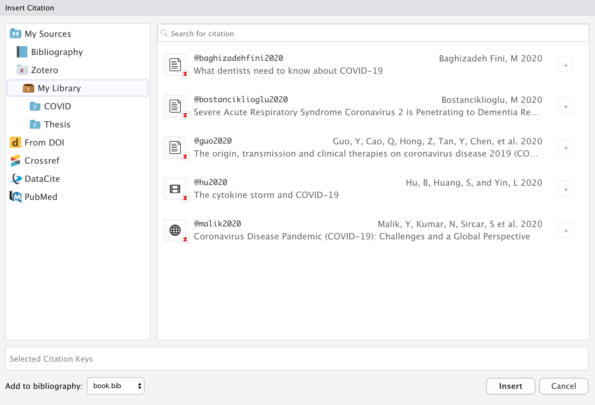
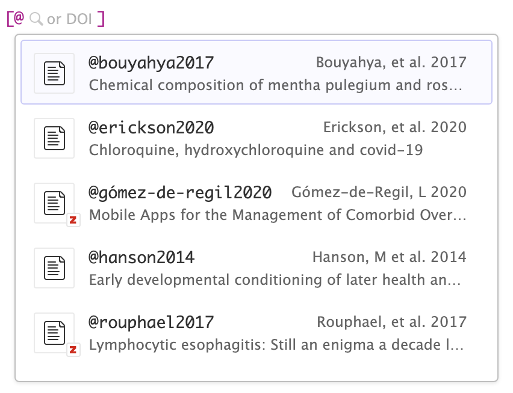
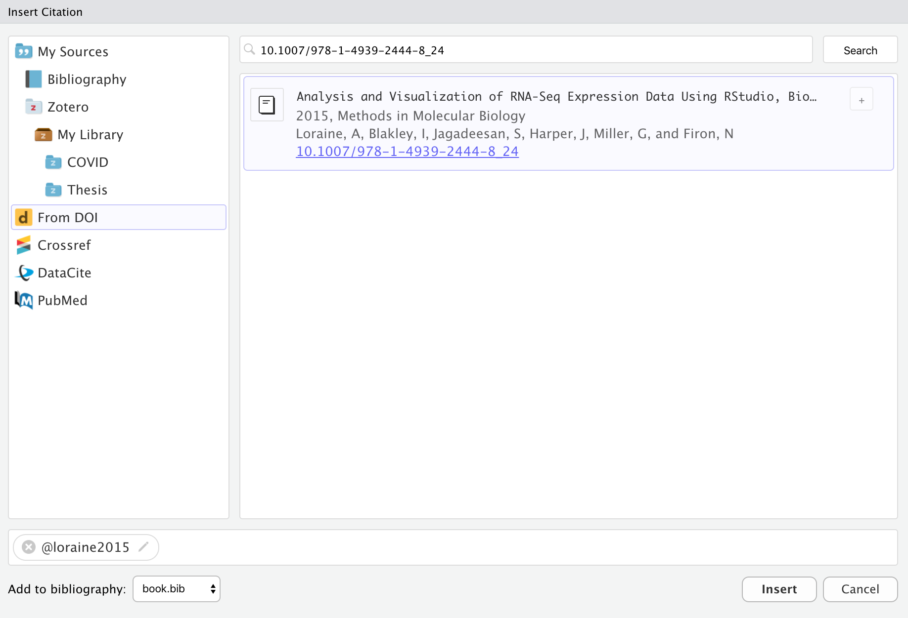
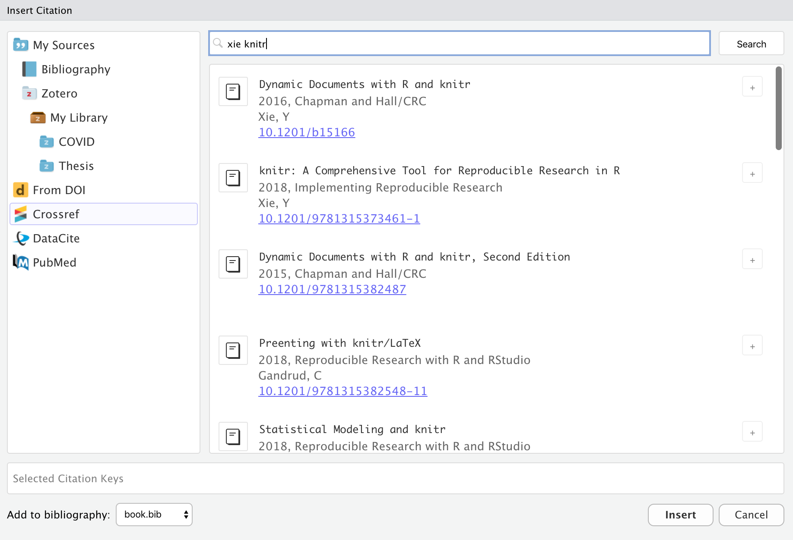

<!-- -*- mode: gfm -*- -->

Visual mode uses the standard Pandoc markdown representation for citations (e.g. `[@citation]`).
Citations can be inserted from a variety of sources:

1.  Your document bibliography.
2.  [Zotero](#citations-from-zotero) personal or group libraries.
3.  [DOI](#citations-from-dois) (Document Object Identifier) references.
4.  Searches of [Crossref](https://www.crossref.org/), [DataCite](https://datacite.org/), or [PubMed](https://pubmed.ncbi.nlm.nih.gov/).

If you insert citations from Zotero, DOI lookup, or a search then they are automatically added to your document bibliography.

## Bibliographies

R Markdown supports bibliographies in a wide variety of formats including BibTeX and CSL.
Add a bibliography to your document using the `bibliography` YAML metadata field.
For example:

``` yaml
---
title: "My Document"
bibliography: references.bib
link-citations: true
---
```

Note that we've also specified the `link-citations` option, which will make your citations hyperlinks to the corresponding bibliography entries.

See the [Pandoc Citations](https://pandoc.org/MANUAL.html#citation-syntax) documentation for additional information on bibliography formats.

## Inserting Citations

You insert citations by either using the **Insert -\> Citation** command or by using markdown syntax directly (e.g. `[@cite]` or `@cite`).

Citations go inside square brackets and are separated by semicolons.
Each citation must have a key, composed of '\@' + the citation identifier from the database, and may optionally have a prefix, a locator, and a suffix.
The citation key must begin with a letter, digit, or `_`, and may contain alphanumerics, `_`, and internal punctuation characters (`:.#$%&-+?<>~/`).
Here are some examples:

<div class="illustration document-example">
  <div>
    Blah Blah <span class="citation">[</span>see <span class="citation">@doe99</span>, pp. 33-35; also <span class="citation">@smith04</span>, chap. 1<span class="citation">]</span>.
  </div>

<div>
  Blah Blah <span class="citation">[</span><span class="citation">@doe99</span>, pp. 33-35, 38-39 and <em>passim</em><span class="citation">]</span>.
  </div>

<div>
  Blah Blah <span class="citation">[</span><span
    class="citation">@smith04</span>;
  <span class="citation">@doe99</span><span class="citation">]</span>.
</div>
  <div>Smith says blah <span class="citation">[</span><span class="citation">-@smith04</span><span class="citation">]</span>.
  </div>
</div>

You can also write in-text citations, as follows:

<div class="illustration document-example">
  <div>
    <span class="citation">@smith04</span> says blah.
  </div>
  <div>
    <span class="citation">@smith04</span> <span class="citation">[</span>p. 33<span class="citation">]</span> says blah.
  </div>
</div>

See the [Pandoc Citations](https://pandoc.org/MANUAL.html#citations) documentation for additional information on citation syntax.

Use the <kbd></kbd> toolbar button or the <kbd>⇧⌘ F8</kbd> keyboard shortcut to show the **Insert Citation** dialog:


Note that you can insert multiple citations by using the add button on the right side of the item display.

### Markdown Syntax

You can also insert citations directly using markdown syntax (e.g. `[@cite]`).
When you do this a completion interface is provided for searching available citations:


### Citation IDs

Before inserting a citation from an external source you may wish to customize its ID.
Within the **Insert Citation** dialog, click the edit button on the right side of citations to change their ID:


If you insert a new citation via code completion, you will also be provided with the opportunity to change its default citation ID.

For citations inserted from Zotero, you can also use the [Better BibTeX](https://retorque.re/zotero-better-bibtex/) plugin to generate citation IDs (this can be enabled via [Citation Options](options#citation-options) if you have Better BibTeX installed).

### Citation Preview

Once you've inserted a citation, place the cursor over it to see a preview of it along with a link to the source if one is available:


## Citations from Zotero

[Zotero](https://zotero.org) is a popular free and open source reference manager.
If you use Zotero, you can also insert citations directly from your Zotero libraries.
If you have Zotero installed locally, its location will be detected automatically and citations from your main library (**My Library**) will be available:



Zotero references will also show up automatically in completions:



Items from Zotero will appear alongside items from your bibliography with a small "Z" logo juxtaposed over them.
If you insert a citation from Zotero that isn't already in your bibliography, then it will be automatically added to the bibliography.

If you are running both RStudio and Zotero on your desktop, then no additional configuration is required for connecting to your Zotero library.
If however you are using RStudio Server and/or want to access your Zotero library over the web, then a few more steps are required (see the [Zotero Web API](#zotero-web-api) section for details).

### Group Libraries

[Zotero Groups](https://www.zotero.org/support/groups) provide a powerful way to share collections with a class or work closely with colleagues on a project.
By default, Zotero Group Libraries are not included in the **Insert Citation** dialog or citation completions.
However, there are options available to use group libraries at a global, per-project, or per-document level.

For example, here we specify a project-level option to use the *Reproducible Research Series (Year 1)* group library:


You can also specify one or more libraries within YAML.
For example:

``` yaml
---
title: "Reproducible Research"
zotero: "Reproducible Research Series (Year 1)"
---
```

Note that you can also turn off Zotero entirely for a document using `zotero: false`:

``` yaml
---
title: "Reproducible Research"
zotero: false
---
```

## Citations from DOIs

Use the **From DOI** pane of the **Insert Citation** dialog to insert a citation based on a DOI (e.g. that you have retrieved from a PubMed or other search):



If you are using markdown syntax, you can also paste a [DOI](https://www.doi.org/) after the `[@` and it will be looked up:


Once you've confirmed that it's the correct work (and possibly modified the suggested ID), the citation will be inserted into the document and an entry for the work added to your bibliography.

## Citations from Search

Use the **Crossref**, **DataCite**, and **PubMed** panes of the **Insert Citation** dialog to search one of those services for a citation:



Items inserted from a search will automatically be added to your bibliography.

Note that for PubMed queries you can use the full supported query syntax.
For example, this query searches on the author and title fields: `Peterson[Author] AND Embolism[Title]`.
You can learn more about building PubMed queries here: <https://pubmed.ncbi.nlm.nih.gov/advanced/>.

## Zotero Web API

If you are using RStudio Server and/or don't have Zotero installed locally, you can still access your Zotero library using the Zotero Web API (assuming you have a Zotero web account and have synced your libraries to your account).

?\> If you are running RStudio Desktop, it's generally easier to also run Zotero on your desktop and access your library locally.
That said, it is possible to access Zotero web libraries from RStudio Desktop if you prefer that configuration.

### API Access Key

RStudio accesses Zotero web libraries using the Zotero Web API, so the first step is to [create a Zotero account](https://www.zotero.org/user/register) and then configure Zotero to sync its data to your account.
You can do this using the **Sync** tab of the Zotero preferences:


Once you've configured your library to sync, you need to [create a Zotero API Key](https://www.zotero.org/settings/keys/new) to use with RStudio:


Follow the instructions to create a new access key.
Note that if you want to use [Group Libraries](#group-libraries) with RStudio that you should change the default to provide read-only access to groups (as illustrated above).

Be sure to **record your key** after generating it (i.e. copy it to the clipboard and/or save it somewhere more permanent) as you won't be able to view it again after you navigate away.

Finally, go to the **R Markdown -\> Citations** preferences to connect Zotero to RStudio using your key:


Set the Zotero Library option to "Web", then paste in your Zotero Web API Key.
You can use **Verify Key...** button to confirm that your Zotero API key is working correctly.

Once you've confirmed your connection, you are ready to start inserting citations from Zotero.
