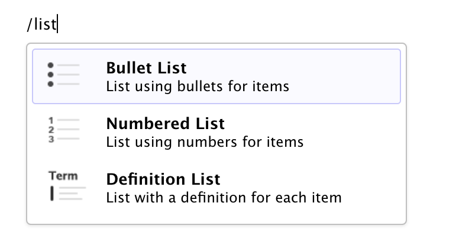
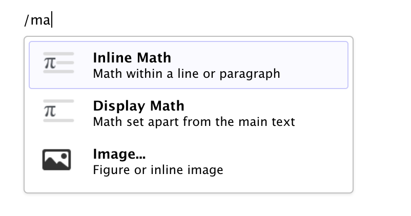

```{r setup, include=FALSE}
knitr::opts_chunk$set(echo = FALSE, message = FALSE, warning = FALSE)
```

<h1>Visual R Markdown</h1>

RStudio v1.4 includes a new visual markdown editing mode. Highlights of visual mode include:

-   Visual editing for all of Pandoc markdown, including tables, divs/spans, definition lists, attributes, etc.

-   Extensive support for citations, including integration with Zotero and the ability to insert citations from DOIs or searches of PubMed, Crossref, and DataCite.

-   Scientific and technical writing features, including cross-references, footnotes, equations, code execution, and embedded LaTeX.

-   Writing productivity features, including real time spell-checking and outline navigation.

-   Tight integration with source editing (editing location and undo/redo state are preserved when switching between modes).

-   Rich keyboard support. In addition to traditional shortcuts, you can use markdown expressions (e.g. `##`, `**bold**`, etc.) for formatting. If you don't remember all of the keyboard shortcuts, you can also use the catch-all <kbd>⌘ /</kbd> shortcut to insert anything.

## Getting Started

Visual markdown editing is currently only available in the [daily build](https://dailies.rstudio.com) of RStudio. You can download the desktop version of the daily build here:

```{r, cache=TRUE}
library(plyr)
library(jsonlite)
library(urltools)
library(parsedate)
library(fs)

version <- "1.4.848"
osx_version <- NULL # "1.4.518"
win_version <- NULL # "1.4.708"

base_url <- "https://s3.amazonaws.com/rstudio-ide-build/desktop"

windows <- list(
   platform = "Windows 10/8/7",
   dir = "windows",
   file = "RStudio-%s.exe"
)

mac <- list(
   platform = "MacOS 10.13+",
   dir = "macos",
   file = "RStudio-%s.dmg"
)

ubuntu <- list(
   platform = "Ubuntu 18/Debian 10",
   dir = "bionic/amd64",
   file = "rstudio-%s-amd64.deb"
)

redhat <- list(
   platform = "Fedora 28/Red Hat 8",
   dir = "centos8/x86_64",
   file = "rstudio-%s-x86_64.rpm"
)

platforms <- list(windows, mac, ubuntu, redhat)

download_info <- lapply(platforms, function(platform) {
   version <- ifelse(platform$dir == "windows" && !is.null(win_version), win_version, version)
   version <- ifelse(platform$dir == "macos" && !is.null(osx_version), osx_version, version)
   platform$file <- sprintf(platform$file, version)
   platform$url <- paste(base_url, platform$dir, platform$file, sep = "/")
   platform$link <- paste0(
      "<a href=\"", platform$url, "\">", 
      "<i class=\"fa fa-download\"></i> ", platform$file, 
      "</a>"
   )
   aws_md5_url <- paste0(
      "https://eb7fgjmu47.execute-api.us-east-1.amazonaws.com/prod/md5?url=",
      urltools::url_encode(platform$url)
   )
   md5_info <- jsonlite::fromJSON(aws_md5_url)
   date <- parse_date(md5_info$last_modified)
   md5_info$date <- format.Date(date, format = "%m/%d/%y %H:%M %Z")
   md5_info$sha256_link <-  paste0(
      "<span class=\"sha256\" data-sha256=\"", md5_info$sha256, "\">", 
         paste0(substr(md5_info$sha256, 1, 8), "..."),
      "</span>"
   )
   md5_info$size <- fs::as_fs_bytes(md5_info$size)
   c(platform, md5_info) 
})

downloads <- ldply(download_info, data.frame, stringsAsFactors = FALSE)

knitr::kable(
   downloads[,c("platform", "link", "size", "sha256_link")], 
   col.names = c("Platform", "Download", "Size", "SHA-256"),
   align = c('l', 'l', 'l', 'l')
)
```

For other desktop platforms or RStudio Server, please visit <https://dailies.rstudio.com>.

?\> Daily builds are intended for testing purposes, and are not recommended for general use.

### Enabling Visual Mode

Markdown documents can be edited in either source or visual mode. To switch into visual mode for a given document, use the <kbd>{width="15" height="13"}</kbd> button at the top-right of the document toolbar (or alternatively the <kbd>⌘⇧ F12</kbd> keyboard shortcut):

{width="700"}

Note that you can switch between source and visual mode at any time (editing location and undo/redo state will be preserved when you switch).

## Using the Editor

### Keyboard Shortcuts

There are keyboard shortcuts for all basic editing tasks. Visual mode supports both traditional keyboard shortcuts (e.g. <kbd>⌘ B</kbd> for bold) as well as markdown shortcuts (using markdown syntax directly). For example, enclose `**bold**` text in asterisks or type `##` and press space to create a second level heading. Here are some of the most commonly used shortcuts:

| Command      | Keyboard Shortcut | Markdown Shortcut |
|--------------|:-----------------:|:-----------------:|
| Bold         |   <kbd>⌘ B</kbd>  |     `**bold**`    |
| Italic       |   <kbd>⌘ I</kbd>  |     `*italic*`    |
| Code         |   <kbd>⌘ D</kbd>  |    `` `code` ``   |
| Link         |   <kbd>⌘ K</kbd>  |      `<href>`     |
| Heading 1    |  <kbd>⌥⌘ 1</kbd>  |        `#`        |
| Heading 2    |  <kbd>⌥⌘ 2</kbd>  |        `##`       |
| Heading 3    |  <kbd>⌥⌘ 3</kbd>  |       `###`       |
| R Code Chunk |  <kbd>⌥⌘ I</kbd>  |  ```` ```{r} ```` |

See the [keyboard shortcuts](shortcuts) article for a complete list of all shortcuts.

### Insert Anything

You can also use the catch-all <kbd>⌘ /</kbd> shortcut to insert just about anything. Just execute the shortcut then type what you want to insert. For example:

{style="display: inline-block" width="350"}

{style="display: inline-block; margin-bottom: 2px;" width="350"}

If you are at the beginning of a line (as displayed above) you can also enter plain `/` to invoke the shortcut.

### Editor Toolbar

The editor toolbar includes buttons for the most commonly used formatting commands:

{width="700"}

Additional commands are available on the **Format**, **Insert**, and **Table** menus:

| Format                                     | Insert                                     | Table                                     |
|--------------------------------------------|--------------------------------------------|-------------------------------------------|
|  |  |  |

## Learning More

Check out the following articles to learn more about visual markdown editing:

-   [Citations](citations) covers citing other works and managing bibliographies, as well as integration with [Zotero](https://www.zotero.org/) (an open source reference management tool).

-   [Technical Writing](technical) covers features commonly used in scientific and technical writing, including cross-references, footnotes, equations, embedded code, and LaTeX.

-   [Content Editing](content) provides more depth on visual editor support for tables, lists, pandoc attributes, comments, symbols/emojis, etc.

-   [Markdown Formats](markdown) describes how the visual editor parses and writes markdown, and also includes some tips for usage with [Bookdown](markdown#bookdown-extensions) and [Hugo](markdown#hugo-markdown).

-   [Editing Shortcuts](shortcuts) documents the two types of shortcuts you can use with the editor: standard keyboard shortcuts and markdown shortcuts.

-   [Editor Options](options) enumerates the various ways you can configure the behavior of the editor (font size, display width, markdown output, etc.).

-   [Additional Topics](additional) discusses various other features including [using CSS](advanced#using-css) within HTML documents.

Thanks for trying out the visual editor! If you encounter problems or want to suggest features, please let us know at <https://github.com/rstudio/rstudio/issues/new/choose>.
