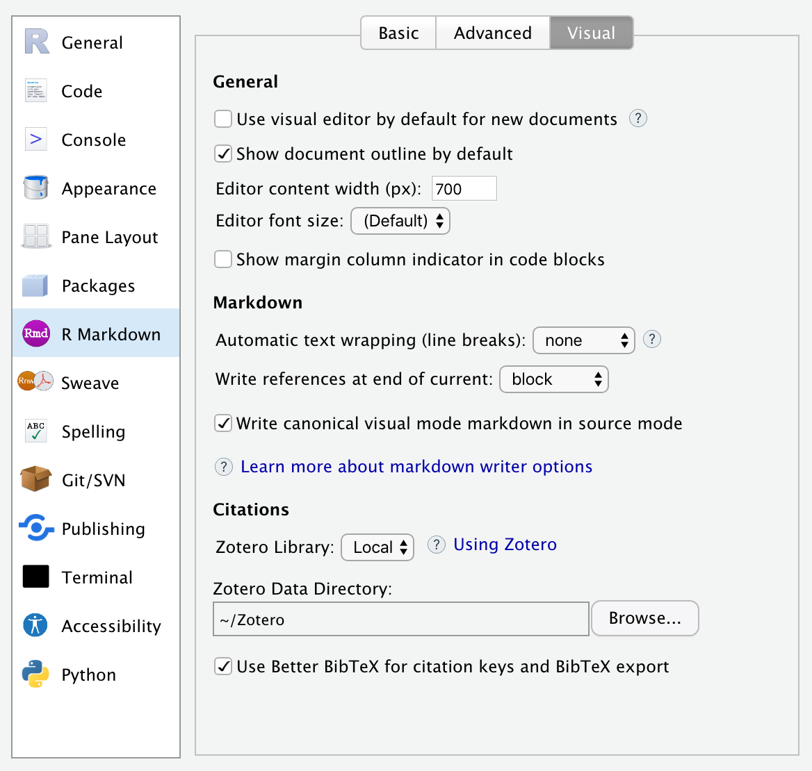
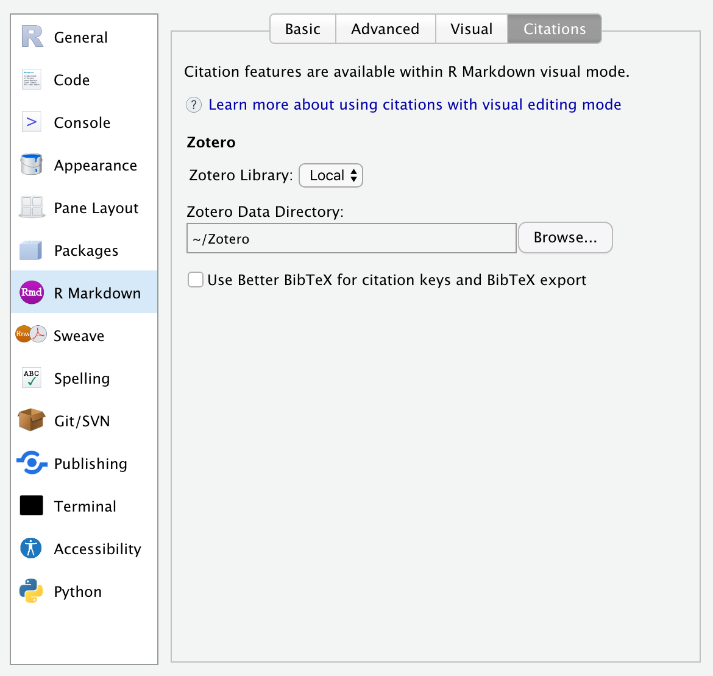
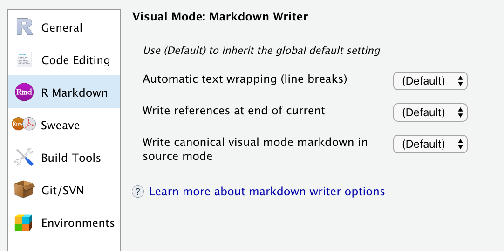

<!-- -*- mode: gfm -*- -->

## Global Options

You can customize visual editing options within **R Markdown -\> Visual**:



| Option                                                 | Description                                                                                                                                                                                          |
|--------------------------------------------------------|------------------------------------------------------------------------------------------------------------------------------------------------------------------------------------------------------|
| Use visual editing by default                          | Switch to visual mode immediately when creating new R Markdown documents.                                                                                                                            |
| Show document outline by default                       | Show the navigational outline when opening documents in visual mode.                                                                                                                                 |
| Editor content width                                   | Maximum width for editing content. This is intended to keep editing similar to the width that users will see.                                                                                        |
| Editor font size                                       | Base font size for editor content (default: inherit from IDE settings).                                                                                                                              |
| Show margin column indicator in code blocks            | Show vertical line that indicates location of editing margin column (e.g. 80).                                                                                                                       |
| Automatic text wrapping (line breaks)                  | When writing markdown, automatically insert line breaks after sentences or at a specified column (default: flow text; no auto-wrapping). See [Line Wrapping](markdown?id=line-wrapping) for details. |
| Write references at end of current                     | Write references (footnotes) at the end of the block or section where they appear, or at the end of the document. See [References](markdown?id=references) for details.                              |
| Write canonical visual mode markdown in source mode    | Use the visual mode markdown writer when saving markdown from source mode (ensure consistency between documents saved from either mode).                                                             |

You can customize visual editor citation options within **R Markdown -\> Citations**:



| Option                                                 | Description                                                                                                                                                                                          |
|--------------------------------------------------------|------------------------------------------------------------------------------------------------------------------------------------------------------------------------------------------------------|
| Zotero Library                                         | Location of [Zotero](citations#citations-from-zotero) citation library (Local or Web).                                                                                                               |
| Zotero Data Directory                                  | Location of Zotero local data directory.                                                                                                                                                             |
| Use Better BibTeX for citation keys and BibTeX export. | Optionally use [Better BibTeX](https://retorque.re/zotero-better-bibtex/) to generate citation keys and export BibTeX from Zotero (this option appears only if Better BibTeX is installed).          |


## Project Options

Global options that affect the way markdown is written can also be customized on a per-project basis. You can do this using the **R Markdown** pane of the **Project Options** dialog:



By default projects inherit the current global settings for markdown writing.

## File Options

Global and project options that affect the way markdown is written can also be customized on a per-file basis . You can do this by including an `editor_options: markdown` key in the YAML front matter of your document. For example:

``` yaml
---
title: "My Document"
author: "Jane Doe"
editor_options:
  markdown:
    wrap: 72
---
```

You might want to do this to ensure that multiple authors on different workstations use the same markdown writing options.

You can also instruct RStudio to use these same options when saving files from source mode. To do this add the `canonical` option. For example:

``` yaml
---
editor_options:
  markdown:
    wrap: 72
    canonical: true
---
```

With `canonical: true`, edits in visual mode and source mode will result in identical markdown output. This is especially useful if you have multiple authors collaborating using version control, with a mixture of source and visual mode editing among the authors.

See the documentation on [Writer Options](markdown#writer-options) for additional details on markdown writing options.
