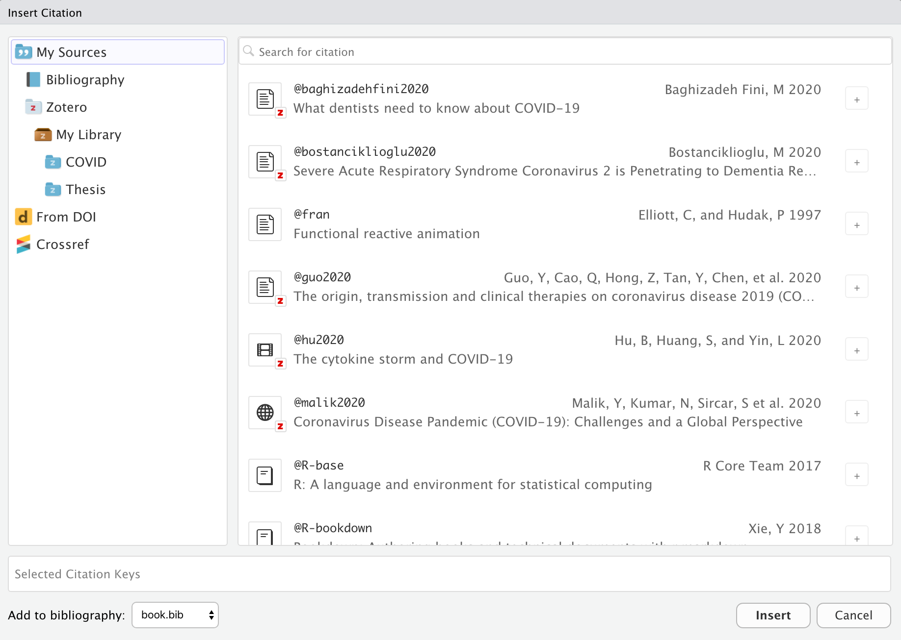
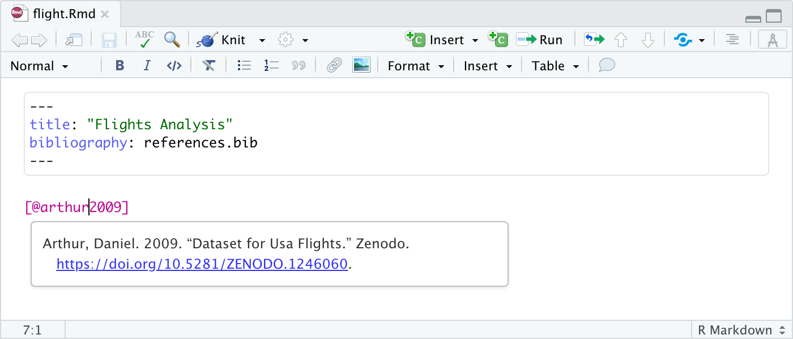
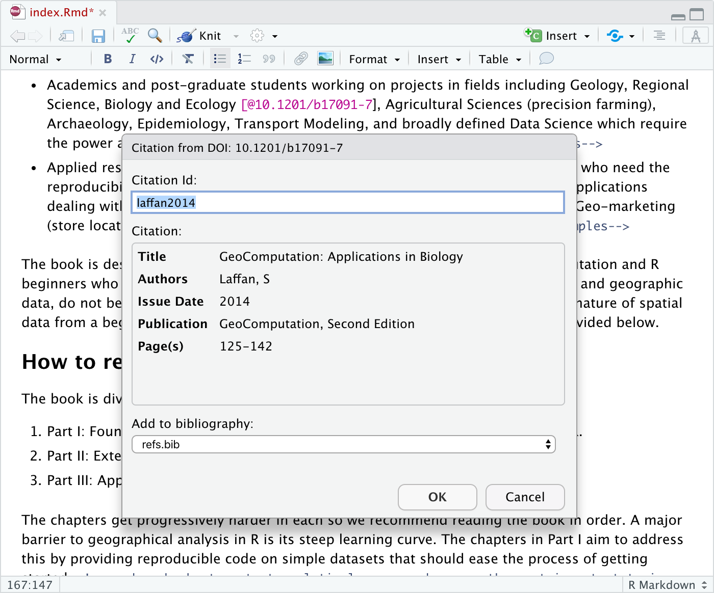
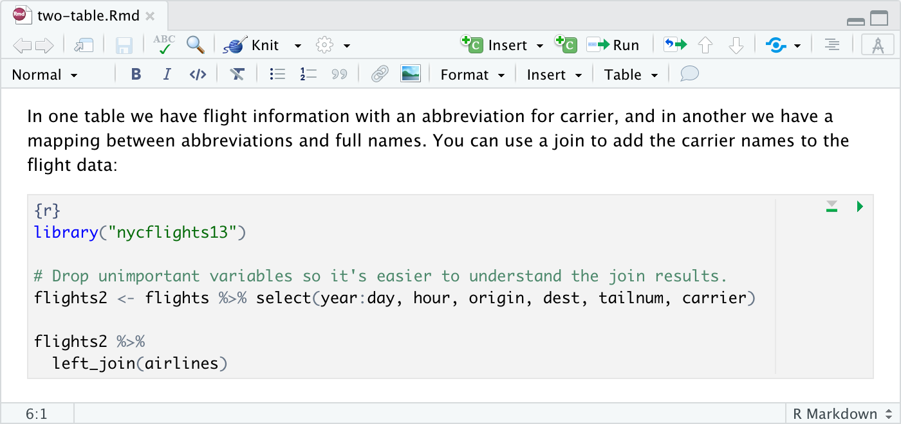

<!-- -*- mode: gfm -*- -->

Visual mode included extensive support for Pandoc features frequently used in technical writing including [citations](#citations), [cross-references](#cross-references), [footnotes](#footnotes), [equations](#equations), [embedded code](#embedded-code), and [LaTeX](#latex-and-html). This articles describes using these features in more depth.

## Citations

Visual mode uses the standard Pandoc markdown representation for citations (e.g. `[@citation])`. Citations can be drawn from a variety of sources:

1.  Document or project level bibliographies.
2.  [DOI](https://www.doi.org/) (Document Object Identifier) references.
3.  [Zotero](https://www.zotero.org/) libraries.

When inserting a citation you can search across all of these sources:



If you insert a citation from a DOI or Zotero library that isn't already in your bibliography then it will be automatically added to the bibliography.

### Specifying a Bibliography

R Markdown supports bibliographies in a wide variety of formats including BibTeX, EndNote, and CSL. Add a bibliography to your document using the `bibliography` YAML metadata field. For example:

``` yaml
---
title: "My Document"
bibliography: references.bib
---
```

BibTeX is the recommended format for bibliographies (as that's the format required for inserting new sources from DOIs and Zotero).

### Inserting Citations

Once you have a bibliography, you can include citations in visual mode by either using the markdown syntax directly (e.g. `[@cite]`), via the **Insert -\> Citation** command, or with the <kbd>⇧⌘ F8</kbd> keyboard shortcut:


As illustrated above, when entering a citation you can search your bibliography and available Zotero collections to make it easier to locate a citation even if you don't remember it's specific ID.

Once you've inserted a citation, place the cursor over it to see a preview of it along with a link to the source if one is available:



### Citations from DOIs

If you are using a BibTeX bibliography (.bib extension) you can also insert citations for works not currently in your bibliography by providing a [DOI](https://www.doi.org/) (Document Object Identifier). Just paste the DOI after the `@` and it will be automatically looked up. For example:



Once you've confirmed that it's the correct work (and possibly modified the suggested ID), the citation will be inserted into the document and an entry for the work added to your BibTeX file.

### Citations from Zotero

If you are using a BibTeX bibliography (.bib extension) you can also insert citations directly from [Zotero](https://zotero.org) libraries. See the [Using Zotero](additional#using-zotero) article for in depth details on connecting RStudio to your Zotero library.

Once you've done the required setup, add the `zotero` YAML metadata field to your documents (or to your `index.Rmd` for bookdown projects). For example:

``` yaml
---
title: "My Document"
bibliography: references.bib
zotero: true
---
```

The above configuration will search your entire Zotero library. If you organize your Zotero library into collections then its highly recommended that you specify a subset of your collections to narrow search results to only items relevant to your current document. For example:

``` yaml
---
title: "My Document"
bibliography: references.bib
zotero: "Thesis"
---
```

Now, when you insert a citation you'll be able to search and insert items from the specified Zotero collection(s):


Items from Zotero will appear alongside items from your bibliography with a small "Z" logo juxtoposed over them. If you insert a citation from Zotero that isn’t already in your bibliography then it will be automatically added to the bibliography.

?\>To use Zotero you need to sync your Zotero library to the web and setup a connection between Zotero and RStudio. See the [Using Zotero](additional#using-zotero) article for additional details on how to do this.

## Cross References

The [bookdown](https://bookdown.org) package includes markdown extensions for cross-references and part headers. The [blogdown](https://bookdown.org/yihui/blogdown/) package also supports bookdown style cross-references as does the [distill](https://rstudio.github.io/distill/) package.

Bookdown cross-references enable you to easily link to figures, equations, and even arbitrary labels within a document. In raw markdown, you would for example write a cross-reference to a figure like this: `\@ref(fig:label)`. Cross-references are largely the same in visual mode, but you don't need the leading `\` (which in raw markdown is used to escape the `@` character). For example:


As shown above, when entering a cross-reference you can search across all cross-references in your project to easily find the right reference ID.

Similar to hyperlinks, you can also navigate to the location of a cross-reference by clicking the popup link that appears when it's selected:


See the bookdown documentation for more information on [cross-references](https://bookdown.org/yihui/bookdown/cross-references.html).

## Footnotes

You can include footnotes using the **Insert -\> Footnote** command (or the <kbd>⇧⌘ F7</kbd> keyboard shortcut). Footnote editing occurs in a pane immediately below the main document:


?\> By default footnotes will be written in markdown immediately below the block in which they appear. You can customize this behavior via [editor options](options).

## Equations

LaTeX equations are authored using standard Pandoc markdown syntax (the editor will automatically recognize the syntax and treat the equation as math). When you aren't directly editing an equation it will appear as rendered math:


As shown above, when you select an equation with the keyboard or mouse you can edit the equation's LaTeX. A preview of the equation will be shown below it as you type.

## Embedded Code

Source code which you include in an R Markdown document can either by for display only or can be executed by knitr as part of rendering. Code can furthermore be either inline or block (e.g. an Rmd code chunk).

### Displaying Code

To display but not execute code, either use the **Insert -\> Code Block** menu item, or start a new line and type either:

1.  ```` ``` ```` (for a plain code block); or
2.  ```` ```<lang> ```` (where \<lang\> is a language) for a code block with syntax highlighting.

Then press the **Enter** key. To display code inline, simply surround text with backticks (`` `code` ``), or use the **Format -\> Code** menu item.

### Code Chunks

To insert an executable code chunk, use the **Insert -\> Code Chunk** menu item, or start a new line and type:

```` ```{r} ````

Then press the **Enter** key. Note that `r` could be another language supported by knitr (e.g. `python` or `sql`) and you can also include a chunk label and other chunk options.

To include inline R code, you just create normal inline code (e.g. by using backticks or the <kbd>⌘ D</kbd> shortcut) but preface it with `r`. For example, this inline code will be executed by knitr: `` `r Sys.Date()` ``. Note that when the code displays in visual mode it won't have the backticks (but they will still appear in source mode).

### Running Chunks

You can execute the currently selected R or Python code chunk using either the run button at the top right of the code chunk or using the <kbd>⇧⌘ Enter</kbd> keyboard shortcut:



You can execute code chunks up to the current one using the toolbar button or using the <kbd>⌥⌘ P</kbd> keyboard shortcut.

?\> You may note that code chunk execution in visual mode is not as full featured as in source mode (e.g. chunk output goes to the console rather than inline, you can execute entire chunks but not individual lines, etc.). Additional chunk execution features are under development and will be added soon.

## LaTeX and HTML

You can also include raw LaTeX commands or HTML tags when authoring in visual mode. The raw markup will be automatically recognized and syntax highlighted For example:


The above examples utilize *inline* LaTex and HTML. You can also include blocks of raw content using the commands on the **Format -\> Raw** menu. For example, here is a document with a raw LaTeX block:


?\> Note that Pandoc ignores LaTeX commands when not producing LaTeX based output, and ignores HTML tags when not producing HTML based output.
